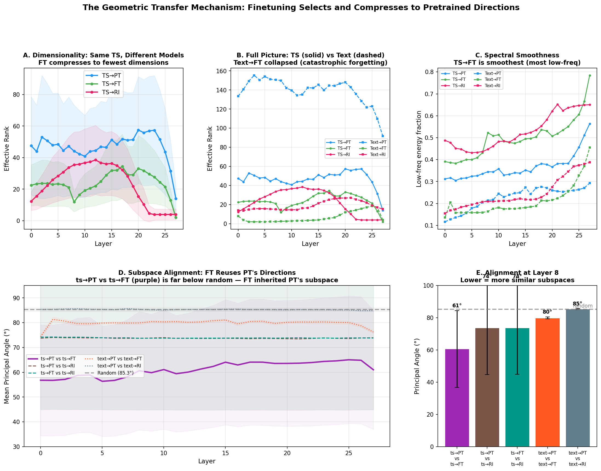
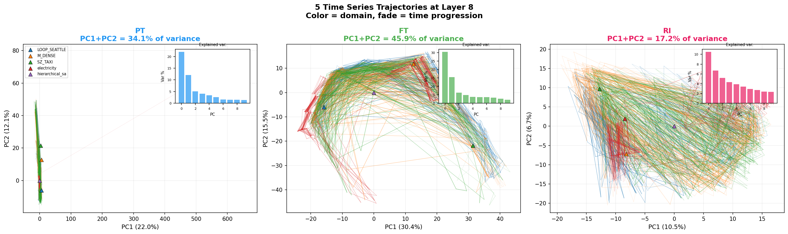
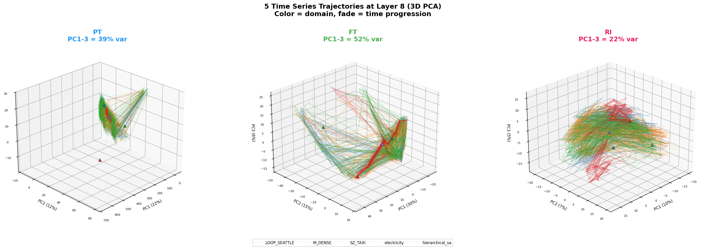
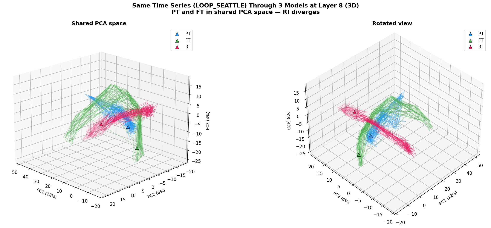
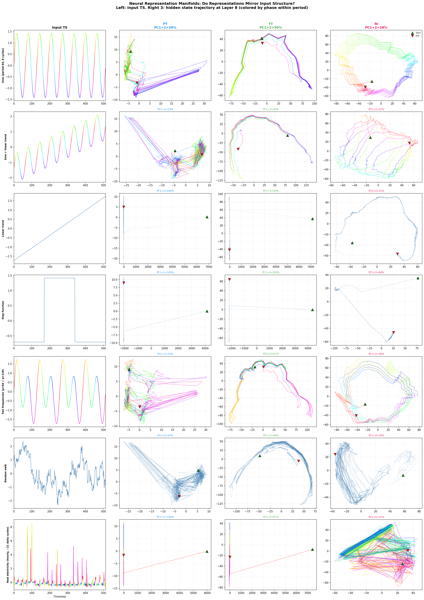
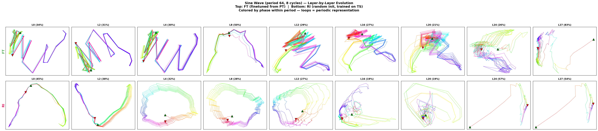

# Representational Geometry of PT, FT, and RI Models

## Experimental Setup

We pass the same inputs through three models sharing the Qwen3-0.6B architecture (28 layers, d=1024):

- **PT**: Pretrained on text only (never seen time series)
- **FT**: PT finetuned on time series (inherits PT weights)
- **RI**: Randomly initialized, trained on time series from scratch

Each model processes both **time series** (binned tokens 0–511) and **text** (WikiText-103), giving 6 conditions. We measure trajectory geometry at all 28 layers: effective rank, PCA dimensionality, spectral energy profile, trajectory speed, persistent homology, and inter-model subspace alignment.

Random baseline for principal angles (500 random 10D subspaces in 1024D): **85.3° ± 0.4°**.

---

## Summary Table (Layer 8)

| Condition   | Eff Rank   | PCs for 90% | Speed  | Low Freq % | β₁ (loops) |
| ----------- | ---------- | ----------- | ------ | ---------- | ---------- |
| TS → PT     | 44 ± 29    | 63          | 16     | 34.5%      | 0.7        |
| **TS → FT** | **12 ± 6** | **15**      | **64** | **52.3%**  | 4.7        |
| TS → RI     | 35 ± 21    | 46          | 78     | 44.7%      | 0.9        |
| Text → PT   | 150 ± 8    | 166         | 24     | 21.4%      | 0.1        |
| Text → FT   | 2.5 ± 1.5  | 3           | 355    | 16.4%      | 8.7        |
| Text → RI   | 15 ± 2     | 22          | 103    | 20.9%      | 12.5       |

### Subspace Alignment (Layer 8)

| Pair               | Mean Angle      | Significance       |
| ------------------ | --------------- | ------------------ |
| **ts@PT vs ts@FT** | **60.6° ± 24°** | *** (most aligned) |
| ts@PT vs ts@RI     | 73.7° ± 29°     | ***                |
| ts@FT vs ts@RI     | 73.7° ± 29°     | ***                |
| text@PT vs text@FT | 79.9° ± 0.7°    | ***                |
| text@PT vs text@RI | 85.4° ± 0.3°    | ≈ random           |
| text@PT vs ts@FT   | 79.2° ± 1.2°    | ***                |
| ts@PT vs text@PT   | 77.6° ± 1.1°    | ***                |

(Random baseline: 85.3° ± 0.4°. *** = below baseline by >2σ.)

---

## Plots
### The Full Transfer Story

*Panel A: FT compresses TS representations to the fewest dimensions. Panel B: Full picture — Text→FT collapsed (catastrophic forgetting). Panel C: TS→FT has the most low-frequency energy (smoothest trajectories). Panel D: Subspace alignment across layers — purple line (ts@PT vs ts@FT) stays far below random. Panel E: Bar chart at Layer 8 confirming ts@PT↔ts@FT is the most aligned pair.*

### Trajectory Manifolds (2D PCA with Explained Variance)

*5 TS domains through each model at Layer 8. FT captures 65.9% of variance in just 2 PCs — highly structured, low-dimensional manifold with clear domain separation. PT captures 34.1% — thin, linear trajectories (barely transforms TS tokens). RI captures 37.2% — diffuse, tangled trajectories. Inset bar charts show the eigenvalue spectrum.*

### Trajectory Manifolds (3D PCA)

*Same data in 3D. FT (52% in 3 PCs): clean, separated trajectory bundles per domain. PT (39%): compressed thin cone. RI (22%): diffuse overlapping cloud requiring many more dimensions to separate.*

### Same TS Through 3 Models (3D Overlay)

*One TS (LOOP_SEATTLE traffic) through all 3 models in a shared PCA space. PT (blue) and FT (green) overlap significantly — they process the same input using similar directions. RI (pink) cuts through at a completely different angle. Two viewing angles confirm this is robust.*

### Manifold Structure: Do Representations Mirror Input Geometry?

*Synthetic TS with known structure passed through all 3 models at Layer 8. Left column: input waveform. Right 3 columns: 2D PCA of hidden state trajectory, colored by phase within period. Key observations: periodic inputs produce looping trajectories in all models. FT creates the tightest phase-coherent loops. RI produces simpler, more symmetric loop shapes — it learned periodic representations from scratch without the complexity of pretrained activation geometry.*

### Sine Wave Layer Evolution: FT vs RI

*A pure sine wave (period 64, 8 cycles) through FT (top) and RI (bottom) across all layers. Both develop loop structure representing periodicity, but with a notable difference: RI's loops are simpler and more symmetric — it learned the minimal representation needed for periodic structure from scratch. FT's loops carry more complex structure inherited from pretraining — the transferred activation geometry is richer but also more convoluted, because FT is reusing representational directions that were originally shaped for language, not time series. The pretrained prior gives FT useful directions (explaining the subspace alignment with PT) but those directions carry additional structure that makes the manifold less "clean" than what RI discovers independently.*

### Phase Coherence: Quantitative Periodicity Test

| TS | PT | FT | RI |
|----|-----|-----|-----|
| Sine p=64 | 0.20 | **0.08** | 0.13 |
| Sine p=128 | 0.30 | **0.12** | 0.20 |
| Two frequencies | 0.34 | **0.12** | 0.21 |

*(Ratio of same-phase distance to all-pairs distance. Lower = stronger periodic structure. FT represents periodicity most explicitly, but all three models capture it to some degree.)*

---

## Key Observations

### 1. Text → PT is high-dimensional because rich text representations require many directions

Text through the pretrained model has by far the highest effective rank (150) and needs 166 PCs for 90% variance. This is expected: language is high-dimensional and the pretrained model has learned to use many representational directions to encode syntax, semantics, entity knowledge, coreference, etc. A good language model *should* produce high-dimensional representations for text.

### 2. TS → PT is moderately high-dimensional because TS tokens are a subset of the text vocabulary

Time series bin tokens (0–511) are a subset of PT's 151,936-token vocabulary. When PT processes these tokens, it doesn't "know" they represent time series — it treats them as rare text tokens and activates a moderate-dimensional subspace (eff rank ~44, 63 PCs for 90%). The representations are less rich than text but still fairly high-dimensional because the pretrained weights spread even unfamiliar tokens across many directions. The trajectory speed is low (16) because PT doesn't make large updates for these unfamiliar tokens — it barely transforms them.

### 3. TS → FT is the most compressed: finetuning found the useful directions and collapsed to them

This is the central finding. FT processes time series with effective rank **12** — dramatically lower than both PT (44) and RI (35) on the same input. It needs only **15 PCs for 90%** (vs 63 for PT, 46 for RI). FT also has the highest low-frequency energy (52.3%), meaning its trajectories are the smoothest.

The interpretation: finetuning from PT discovered a small set of representational directions that are useful for time series and learned to project TS representations onto those directions. The starting point (PT's pretrained weights) already contained directions that encode smooth temporal dynamics — finetuning identified and amplified those specific directions while discarding the rest. The result is a compact, low-dimensional, spectrally smooth representation optimized for temporal data.

RI, by contrast, found a higher-dimensional representation (eff rank 35, 46 PCs for 90%) because it had to learn everything from scratch without the benefit of PT's pre-existing useful directions. It converged to a workable but less efficient encoding.

### 4. Text → FT is almost completely destroyed: catastrophic forgetting in geometric terms

Text through FT has effective rank **2.5** with only **3 PCs for 90%** — the model has essentially collapsed text representations to near-nothing. The trajectory speed is 355 (15x higher than Text→PT), meaning the model makes enormous, erratic updates when processing text tokens it no longer understands.

This is catastrophic forgetting observed geometrically: the gradients during TS finetuning actively reshaped the model's weight matrices to compress information along the directions useful for time series. This simultaneously destroyed the many directions that were previously used for text representations. The model traded ~150 text-useful dimensions for ~12 TS-useful dimensions.

### 5. ts@PT and ts@FT are the most aligned pair: FT reuses PT's directions

The subspace alignment analysis provides the strongest evidence for geometric transfer. Among all model pairs processing the same input:

- **ts@PT vs ts@FT: 60.6°** — the most aligned pair, well below the random baseline of 85.3°
- ts@PT vs ts@RI: 73.7° — significantly aligned but much less so
- ts@FT vs ts@RI: 73.7° — FT and RI use moderately different subspaces

The fact that ts@PT vs ts@FT is so much more aligned than any other pair means: **when FT processes time series, it uses directions that are close to the directions PT uses for the same input**. FT didn't find arbitrary new directions — it reused the specific directions that PT's pretrained weights naturally activate for TS tokens.

This is the geometric mechanism for transfer: PT's pretraining created a set of representational directions. Some of those directions happen to be useful for time series (they encode smooth temporal dynamics). FT's finetuning identified those directions and learned to use them efficiently. RI, starting from random weights, had no such prior and found different directions (73.7° from PT, essentially a different region of representational space).

The comparison with text alignment reinforces this:

- text@PT vs text@FT: 79.9° — text representations partially shifted during finetuning
- text@PT vs text@RI: 85.4° — indistinguishable from random (RI has zero text knowledge)

### 6. RI is degenerate at deep layers

RI shows pathological behavior at layers 22+: effective rank collapses to ~4, trajectory speed explodes to 3800+. Without pretrained initialization, the deep layers failed to learn stable representations. FT avoids this because it inherited PT's well-conditioned weight matrices.

---

## The Transfer Story in Geometric Terms

1. **Pretraining creates a rich, high-dimensional representational space** (~150 effective dimensions for text, ~44 for unfamiliar tokens). This space contains many directions, some of which encode smooth temporal dynamics as a byproduct of modeling coherent text sequences.
2. **Finetuning identifies the useful subset of directions** and compresses TS representations onto them (eff rank 44 → 12). It doesn't create new directions — it selects from PT's existing repertoire. This is evidenced by the 60.6° alignment between ts@PT and ts@FT.
3. **The selected directions are efficient**: FT achieves the lowest dimensionality (12), the highest low-frequency energy (52%), and the smoothest trajectories. These are exactly the properties needed for time series processing.
4. **RI converges to a different, less efficient solution**: Without PT's directional prior, RI finds a higher-dimensional representation (35) in a different subspace (73.7° from PT). It works, but uses more dimensions to encode the same information.
5. **The cost of compression is catastrophic forgetting**: The directions FT amplified for TS came at the expense of the ~140 directions previously used for text (Text→FT eff rank = 2.5).

The main takeaway: **language pretraining provides a geometric prior — a set of representational directions — that includes directions naturally suited for temporal data. Transfer learning exploits this prior by identifying and collapsing to the useful directions, rather than learning new ones from scratch.**