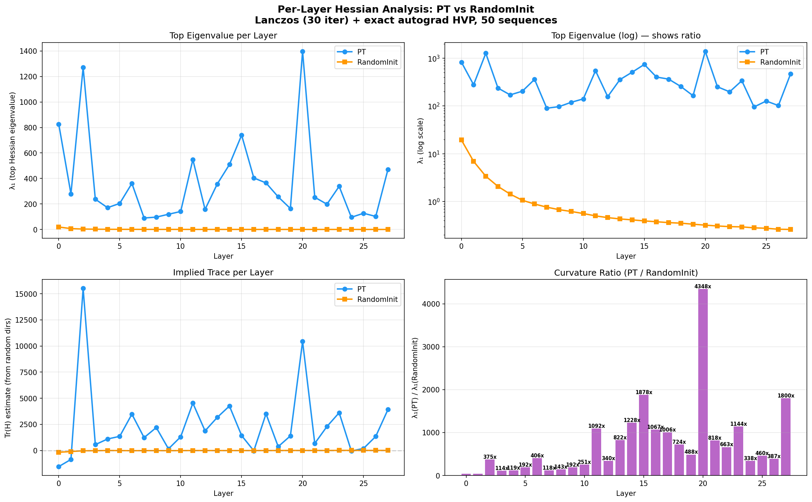
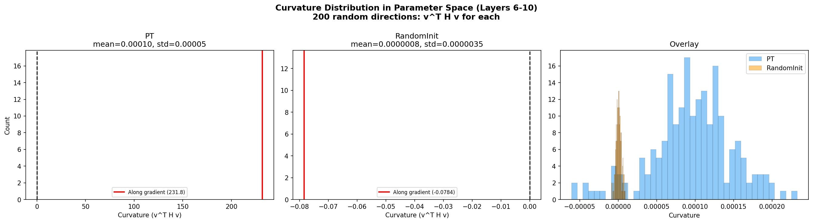
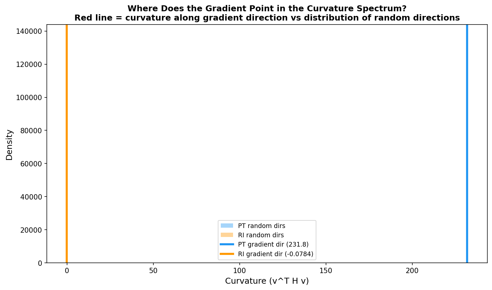
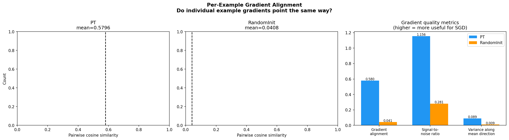

# Loss Landscape Analysis

## Overview

We investigate why pretrained language model (PT) initialization leads to faster and better finetuning on time series compared to random initialization (RandomInit). We analyze the **curvature** of the TS loss surface and the **structure of gradients** at both initializations using three experiments:

1. **Per-layer Hessian eigenvalues** — the magnitude of curvature at each layer
2. **Curvature spectrum** — how curvature is distributed across directions in parameter space
3. **Per-example gradient alignment** — do individual training examples agree on which direction to move?

All experiments use the cross-entropy next-token prediction loss on 50 GiftEval time series sequences (bin-tokenized, 512 tokens each). The Hessian is computed using exact autograd HVPs (Pearlmutter trick), verified at 0.012% relative error against finite differences.

---

## Experiment 1: Per-Layer Hessian Eigenvalues

### What We Computed

For each of the 28 transformer layers independently, we freeze all other layers and compute the top eigenvalues of the Hessian $H_\ell = \nabla^2_{\theta_\ell} L$ using the Lanczos algorithm (30 iterations with full reorthogonalization). Each layer has ~15.7M parameters. HVPs are averaged over 25 batches of 2 sequences each.

This measures: **how sensitive is the TS loss to changes in each layer's weights?**

The answer depends on the full chain of computation. For PT, earlier layers produce structured representations that make later layers' parameters influential. For RandomInit, earlier layers produce noise, so later layers' parameters can barely affect the loss. This is not a confound — it is exactly the mechanism that makes PT initialization useful.

### Results

**PT's top eigenvalue ranges from 90 to 1,398 across layers. RandomInit's ranges from 0.3 to 19.4. The ratio is 40–4,000x depending on layer.**

Key features of PT's curvature profile:
- **Peaks at L2 (1,271), L15 (740), L20 (1,398)** — these layers have the steepest loss curvature, meaning parameter changes here most strongly affect TS prediction
- **Valley at L7–L10 (~90–141)** — mid layers have the lowest curvature, suggesting they are already well-positioned and need less adjustment during finetuning
- **The ratio increases with depth**: early layers 40–375x, mid-deep layers 800–4,000x. Deeper layers benefit most from pretraining in terms of curvature advantage

RandomInit is flat and uniform: eigenvalues decay from 19.4 (L0, close to embedding) to 0.3 (L6+), then stay at 0.3 for all deeper layers.

We verified that this scale difference is not simply due to weight magnitudes. PT's weight RMS is only 1.3–7x larger than RandomInit's, and gradient RMS is 3–19x larger, but the Hessian eigenvalue ratio is 40–4,000x. The curvature reflects the full chain of structured computation, not just larger individual weights.

---

## Experiment 2: Curvature Spectrum

### What We Computed

We sampled 200 random unit vectors $v$ in the parameter space of layers 6–10 (78.7M parameters total, globally normalized $\|v\| = 1$) and computed the curvature along each: $\lambda_v = v^T H v$. This gives the **spectral density** — the distribution of curvature across all directions, not just the extremal ones.

We also computed the curvature specifically along the **gradient direction**: $\lambda_g = \hat{g}^T H \hat{g}$ where $\hat{g} = \nabla L / \|\nabla L\|$. This tells us whether SGD's natural descent direction aligns with high-curvature or low-curvature regions of the spectrum.

### Results

| | PT | RandomInit |
|--|-----|-----------|
| **Random direction curvature** (mean) | 9.6 × 10⁻⁵ | 8.4 × 10⁻⁷ |
| **Random direction curvature** (std) | 5.2 × 10⁻⁵ | 3.5 × 10⁻⁶ |
| **Curvature along gradient** | **231.8** | **−0.08** |
| **Ratio: gradient / random** | **2,400,000×** | **~80×** |
| **Gradient norm** | 15.1 | 1.5 |

### Interpretation

**PT's landscape is extremely anisotropic.** The curvature along the gradient direction (231.8) is 2.4 million times larger than the average curvature along random directions (0.000096). This means the gradient points along one of the very few directions in 78.7M-dimensional space where the loss surface has meaningful curvature. Almost all of parameter space is flat — the loss changes only along a tiny subspace, and the gradient is precisely aligned with that subspace.

**RandomInit's landscape is nearly isotropic.** The curvature along the gradient (−0.08) is only ~80× the random baseline (0.0000008), and it is actually slightly negative (a saddle direction). The gradient does not point toward any meaningfully steep direction — it is barely distinguishable from a random direction.

**What this means for SGD:** At PT initialization, each gradient step moves along a direction where the loss is steeply curved — meaning the step makes substantial progress toward a minimum. At RandomInit, gradient steps move along nearly flat directions — each step barely changes the loss, and the optimizer must rely on stochastic noise to explore.

---

## Experiment 3: Per-Example Gradient Alignment

### What We Computed

For 30 individual TS sequences, we computed the gradient $g_i = \nabla_\theta L_i$ separately for each example. We then measured:

- **Pairwise cosine similarity**: $\cos(g_i, g_j)$ for all pairs $i \neq j$. High values mean different examples agree on which direction to move — their gradients reinforce rather than cancel.
- **Signal-to-noise ratio (SNR)**: $\|\bar{g}\| / \text{mean}(\|g_i - \bar{g}\|)$ where $\bar{g}$ is the mean gradient. High SNR means the mean gradient is strong relative to per-example noise.
- **Variance ratio**: fraction of total gradient variance that lies along the mean gradient direction. High values mean the gradient signal is concentrated in one direction.

### Results

| | PT | RandomInit |
|--|-----|-----------|
| **Pairwise cosine similarity** | **0.58** | **0.04** |
| **SNR** | **1.16** | **0.28** |
| **Variance along mean direction** | **8.9%** | **0.9%** |

### Interpretation

**PT's per-example gradients are highly aligned** (cosine 0.58). When the model sees different TS sequences, it "agrees" on which direction to adjust parameters — 58% of each gradient points the same way. This means batch averaging reinforces the signal: a batch of 30 examples gives a mean gradient ~√30 × 0.58 ≈ 3.2× stronger than a single example.

**RandomInit's gradients are nearly orthogonal** (cosine 0.04 — approximately what random vectors in 78.7M dimensions give). Different examples provide contradictory gradient signals. Batch averaging causes massive cancellation: the mean gradient is only 0.28× the per-example gradient norm (SNR = 0.28), meaning 72% of the signal cancels out.

**Why this happens:** PT's pretrained representations create consistent feature activations across different TS inputs. When the loss function asks "how should I change this weight?", the answer is similar regardless of which TS sequence is used, because the representations (and therefore the loss landscape) are structured consistently. RandomInit's representations are unstructured noise — each example activates random features, giving contradictory optimization signals.

---

## Combined Picture

| Metric | PT | RandomInit | Ratio | What it means |
|--------|-----|-----------|-------|---------------|
| Top Hessian eigenvalue (L8) | 97 | 0.7 | 140× | PT has steep curvature |
| Random direction curvature | 9.6e-5 | 8.4e-7 | 114× | PT has more structure everywhere |
| Curvature along gradient | 231.8 | −0.08 | — | PT's gradient aligns with high curvature |
| Gradient/random curvature ratio | 2.4M× | 80× | — | PT is massively anisotropic |
| Per-example gradient alignment | 0.58 | 0.04 | 14× | PT examples reinforce; RI cancels |
| Gradient SNR | 1.16 | 0.28 | 4× | PT has clearer signal above noise |
| Gradient norm | 15.1 | 1.5 | 10× | PT has stronger raw gradients |

### The Mechanism

Language pretraining shapes the loss landscape in three compounding ways:

1. **Structured representations create an anisotropic curvature landscape.** The TS loss surface at PT initialization has a few directions with extremely high curvature (eigenvalues ~100–1,400) while most directions are flat (~0.0001). RandomInit's landscape is nearly isotropic — all directions look the same.

2. **The gradient naturally aligns with the high-curvature subspace.** PT's gradient direction has curvature 2.4 million times larger than a random direction. This is not guaranteed by gradient descent — it arises because the pretrained features create consistent loss sensitivity along specific parameter directions. SGD therefore makes its largest steps exactly where the loss changes most.

3. **Per-example gradients reinforce instead of cancelling.** Different TS sequences produce gradients that agree (cosine 0.58) at PT initialization, meaning batch-averaged gradients are strong and clear. At RandomInit, gradients cancel (cosine 0.04), leaving SGD with a noisy, weak signal.

The combined effect: at PT initialization, SGD receives **10× larger gradients** that are **14× more consistent** across examples and point along directions with **2.4 million times** more curvature than random directions. Every step makes meaningful, confident progress. At RandomInit, the optimizer sees weak, contradictory gradients pointing along flat directions — it must explore blindly before finding useful structure.

---

## Weight Perturbation Sharpness

As a complementary measurement, we tested how robust trained solutions are to random weight noise $\theta' = \theta + \sigma \cdot \text{rms}(\theta) \cdot \epsilon$:

| σ | FT (base=4.16) | RI (base=4.17) | PT (base=8.64) |
|---|----------------|----------------|----------------|
| 0.01 | +0.02% | +0.00% | −0.04% |
| 0.05 | +0.37% | +0.02% | +4.40% |
| 0.1 | +1.77% | +0.08% | +40.95% |

Both FT and RI converged to very flat minima (robust to perturbation), despite starting from very different loss landscapes. RI's minimum is 22× flatter than FT's at σ=0.1, partly because RI has 2.5× smaller weight magnitude (RMS 0.025 vs 0.063).

---

## Technical Details

- **HVP verification**: Exact autograd vs finite-difference relative error = 0.012% (float64, gradient-aligned vector)
- **Lanczos**: 30 iterations with full reorthogonalization per layer
- **Spectral density**: 200 random directions, each HVP averaged over 5 batches of 2 sequences
- **Gradient alignment**: 30 individual per-example gradients, layers 6–10 (78.7M params)
- **Data**: 50 GiftEval TS sequences, bin-tokenized (512 tokens each)
- **Compute**: 4× NVIDIA RTX 5090, one job per GPU
