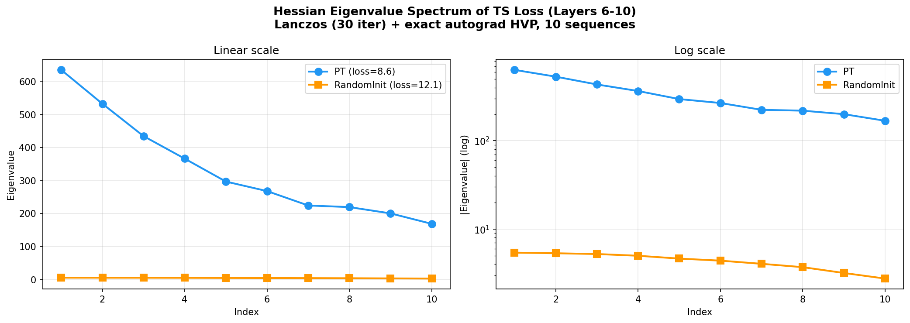
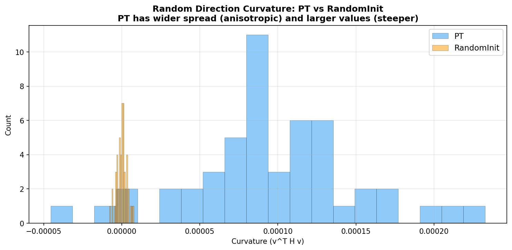
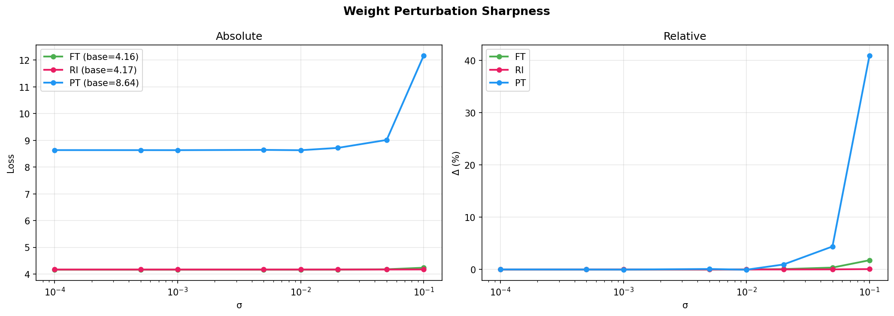

# Loss Landscape Analysis (v3 — Verified)

## Verification

HVP correctness: autograd vs finite-difference relative error = **0.012%** (float64, layer 8, gradient-aligned vector). Implementation is exact.

Gradient checkpointing disabled (incompatible with `create_graph=True`).

Vector normalization is global: $\|v\| = 1$ computed over all 78.7M parameters jointly (not per-layer).

---

## Experiment 1: Hessian Eigenvalues at Initialization

### Method

- **Algorithm**: Lanczos (30 iterations) with full reorthogonalization
- **HVP**: Exact autograd, averaged over 10 single-sequence batches
- **Parameters**: Layers 6-10 (78.7M params, mid-layers with most transferable structure)
- **Data**: 10 TS sequences × 512 tokens from GiftEval

### Results

| Eigenvalue | PT init | RandomInit | Ratio |
|-----------|---------|-----------|-------|
| λ₁ | 634.8 | 5.4 | 117x |
| λ₂ | 532.1 | 5.3 | 100x |
| λ₃ | 434.1 | 5.2 | 83x |
| λ₄ | 365.9 | 5.0 | 73x |
| λ₅ | 296.5 | 4.6 | 64x |
| λ₆ | 267.7 | 4.4 | 61x |
| λ₇ | 224.1 | 4.0 | 56x |
| λ₈ | 219.2 | 3.7 | 59x |
| λ₉ | 200.1 | 3.2 | 63x |
| λ₁₀ | 168.5 | 2.8 | 60x |
| **Sum of top 10** | **3,343** | **43.6** | **77x** |
| **Condition ratio** (λ₁/λ₁₀) | **3.8** | **1.9** | |
| **Base TS loss** | **8.6** | **12.1** | |

### Normalized Spectrum (λᵢ / λ₁)

Shows spectrum shape independent of absolute scale:

| | PT | RandomInit |
|--|-----|-----------|
| λ₁/λ₁ | 1.000 | 1.000 |
| λ₂/λ₁ | 0.838 | 0.981 |
| λ₃/λ₁ | 0.684 | 0.963 |
| λ₅/λ₁ | 0.467 | 0.852 |
| λ₁₀/λ₁ | 0.265 | 0.519 |

**PT has steeper spectral decay** — top eigenvalue is 3.8x the 10th, meaning curvature is concentrated in a few directions. RandomInit's spectrum is flatter (ratio 1.9x) — more isotropic.

### Lanczos also finds negative eigenvalues

The full 30 Lanczos eigenvalues for PT include large negative values (down to -1393), confirming PT is near a **saddle point**, not a local minimum. The optimizer can descend in both positive and negative curvature directions.

---

## Experiment 2: Random-Direction Curvature

### Method

50 random unit vectors $v$ in parameter space (globally normalized $\|v\|=1$), compute $v^T H v$ for each.

For a random direction in $d$-dimensional space:

$$E[v^T H v] = \frac{\text{Tr}(H)}{d}$$

This gives a Hutchinson-style trace estimate and measures "typical" curvature.

### Results

| | PT | RandomInit |
|--|-----|-----------|
| Mean $v^T H v$ | 9.6 × 10⁻⁵ | -3.4 × 10⁻⁷ |
| Std | 5.3 × 10⁻⁵ | 2.8 × 10⁻⁶ |
| Range | [-5.3e-5, 2.3e-4] | [-7.9e-6, 7.1e-6] |
| **Implied Tr(H)** | **~7,500** | **~-27** |

**PT has ~30x larger curvature along typical random directions** and much wider spread. RandomInit has near-zero curvature everywhere.

### Effective rank interpretation

The ratio of top eigenvalue to mean random-direction curvature gives the **effective dimensionality of curvature**:

$$\frac{\lambda_1}{E[v^T H v]} = \frac{\lambda_1}{\text{Tr}(H)/d} = \frac{\lambda_1 \cdot d}{\text{Tr}(H)}$$

For PT: 634.8 / 9.6e-5 ≈ 6.6 million. With $d$ = 78.7M, this implies Tr(H) ≈ 7,500 and the "effective rank of curvature" (how many eigenvalues contribute meaningfully to the trace) is $\text{Tr}(H)^2 / \|\lambda\|^2$. The extreme ratio confirms that curvature is concentrated in a vanishingly small subspace of the 78.7M-dimensional parameter space.

---

## Experiment 3: Weight Perturbation Sharpness

### Method

Gaussian noise $\theta' = \theta + \sigma \cdot \text{rms}(\theta) \cdot \epsilon$, 8 noise levels, 5 samples each, 50 TS sequences.

### Results

| σ | FT (base=4.16) | RI (base=4.17) | PT (base=8.64) |
|---|----------------|----------------|----------------|
| 0.001 | +0.00% | +0.00% | -0.01% |
| 0.01 | +0.02% | +0.00% | -0.04% |
| 0.05 | +0.37% | +0.02% | +4.40% |
| 0.1 | +1.77% | +0.08% | +40.95% |

| | FT | RI | PT |
|--|-----|-----|-----|
| Weight RMS | 0.063 | 0.025 | 0.059 |

**RI found a flatter minimum** (22x less degradation than FT at σ=0.1). PT at initialization is sharpest (+41%).

---

## Experiment 4: Per-Layer Hessian Profile (All 28 Layers)

### Method

Same as Experiment 1 but computed **independently for each of the 28 layers**. Each layer's parameters (~15.7M) analyzed with Lanczos (30 iter) + 30 random-direction curvatures, averaged over 25 batches of 2 sequences (50 total). Run in parallel on 4 GPUs (7 layers each).

### Results

| Layer | PT λ₁ | RI λ₁ | Ratio |
|-------|-------|-------|-------|
| L0 | 827 | 19.4 | 43x |
| L2 | **1271** | 3.4 | 375x |
| L7-L9 | 90-119 | 0.6-0.8 | 118-192x |
| L11 | 548 | 0.5 | 1092x |
| L14-L15 | 509-740 | 0.4 | 1228-1878x |
| L20 | **1398** | 0.3 | **4348x** |
| L24-L26 | 96-127 | 0.3 | 338-460x |
| L27 | 470 | 0.3 | 1800x |

### Key findings

1. **PT curvature is highly non-uniform across layers.** Peaks at L2 (1271), L15 (740), L20 (1398). Valleys at L7-L9 (~90-119). The TS loss surface has very different structure at different layers.

2. **RandomInit is flat and uniform.** λ₁ decays from 19.4 (L0) to 0.3 (L6+). No layer has meaningful curvature. The early-layer gradient (19→7→3→2→1→0.3) reflects proximity to the embedding layer.

3. **The PT/RandomInit ratio increases with depth.** Early layers: 40-375x. Mid-deep layers (L11-L20): 800-4000x. This means **deeper layers benefit most from pretraining** in terms of curvature advantage.

4. **L20 is an extreme outlier** (λ₁=1398, condition 13.7, ratio 4348x). This layer has uniquely strong, anisotropic curvature — possibly a critical architectural transition point.

5. **The mid-layer curvature valley (L7-L9)** where PT's eigenvalues dip to ~90-120 coincides with the layers our geometry analysis found most "transferable" (highest subspace alignment between PT and FT). Low curvature at these layers may mean they are already well-positioned and need minimal adjustment during finetuning.

---

## Combined Interpretation

1. **PT has strong, anisotropic curvature.** Top eigenvalues are 60-120x larger than RandomInit. Curvature is concentrated in a few directions — the top eigenvalue is 6.6M× the mean random-direction curvature.

2. **RandomInit is flat and isotropic.** Near-zero curvature in all directions, including the top eigenvectors (~5 vs PT's ~600). No useful gradient signal for the optimizer.

3. **PT is near a saddle point** (large negative eigenvalues down to -1393). This is expected for an untrained model on a new task — the negative curvature directions are "descent opportunities" that the optimizer can exploit immediately.

4. **The transfer advantage is directional gradient signal.** PT provides the optimizer with a few high-curvature directions pointing toward good TS solutions. RandomInit has no such guidance and must discover useful directions from scratch.

5. **Both FT and RI converge to flat minima**, but RI's is flatter. This may be because RI's smaller weight magnitude (RMS 0.025 vs 0.063) naturally leads to wider basins.
